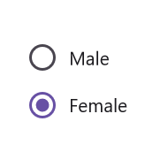

# Getting Started with .NET MAUI RadioButton (SfRadioButton)

This section provides a quick overview for working with the SfRadioButton for .NET MAUI. Walk through the entire process of creating a real world of this control.

## Creating an application using the .NET MAUI Radio Button
 1. Create a new .NET MAUI application in Visual Studio.
 2. Syncfusion .NET MAUI components are available on [nuget.org](https://www.nuget.org/). To add SfRadioButton to your project, open the NuGet package manager in Visual Studio, search for Syncfusion.Maui.Buttons and then install it.

## Register the handler

To use this control inside an application, you must register the handler for Syncfusion® core.

**C#**
```
using Microsoft.Extensions.Logging;
using Syncfusion.Maui.Core.Hosting;

namespace RadioButtonGettingStarted
{
    public static class MauiProgram
    {
        public static MauiApp CreateMauiApp()
        {
            var builder = MauiApp.CreateBuilder();
            builder
                .UseMauiApp<App>()
                .ConfigureSyncfusionCore()
                .ConfigureFonts(fonts =>
                {
                    fonts.AddFont("OpenSans-Regular.ttf", "OpenSansRegular");
                    fonts.AddFont("OpenSans-Semibold.ttf", "OpenSansSemibold");
                });

#if DEBUG
    		builder.Logging.AddDebug();
#endif

            return builder.Build();
        }
    }
}

```

## Add a basic Radio Button
1. Import the control namespace `Syncfusion.Maui.Buttons` in XAML or C# code.
2. Initialize [SfRadioButton](https://help.syncfusion.com/cr/maui/Syncfusion.Maui.Buttons.SfRadioButton.html) control.

**XAML**
```
<ContentPage
    . . .    
    xmlns:buttons="clr-namespace:Syncfusion.Maui.Buttons;assembly=Syncfusion.Maui.Buttons">
        <buttons:SfRadioButton x:Name="radioButton"/>     
</ContentPage>
```

**C#**
```
    using Syncfusion.Maui.Buttons;
    namespace RadioButtonGettingStarted
    {
        public partial class MainPage : ContentPage
        {
            public MainPage()
            {
                InitializeComponent();           
                SfRadioButton radioButton = new SfRadioButton();
                this.Content=radioButton
            }
        }   
    }

```

## Change the Radio Button state

The two different visual states of the [.NET MAUI Radio Button](https://help.syncfusion.com/cr/maui/Syncfusion.Maui.Buttons.SfRadioButton.html) are:

* Checked
* Unchecked

To change the state of the .NET MAUI Radio Button, you can utilize the [IsChecked](https://help.syncfusion.com/cr/maui/Syncfusion.Maui.Buttons.SfRadioButton.html#Syncfusion_Maui_Buttons_SfRadioButton_IsChecked) property of [SfRadioButton](https://help.syncfusion.com/cr/maui/Syncfusion.Maui.Buttons.SfRadioButton.html). When the Radio Button is checked, an inner circle is added to its visualization.

You can group multiple Radio Buttons together by using Radio Group. Only one button within a group can be selected at a time.

**XAML**
```
    <buttons:SfRadioGroup x:Name="radioGroup">
         <buttons:SfRadioButton x:Name="male" Text="Male"/>
         <buttons:SfRadioButton x:Name="female" Text="Female" IsChecked="True"/>
    </buttons:SfRadioGroup>
```

**C#**
```
    SfRadioGroup radioGroup = new SfRadioGroup();
    SfRadioButton male = new SfRadioButton();
    male.Text = "Male";
    SfRadioButton female = new SfRadioButton();
    female.IsChecked = true;
    female.Text = "Female";
    radioGroup.Children.Add(male);
    radioGroup.Children.Add(female);
    this.Content = radioGroup;
```
Run the application to render the following output:


